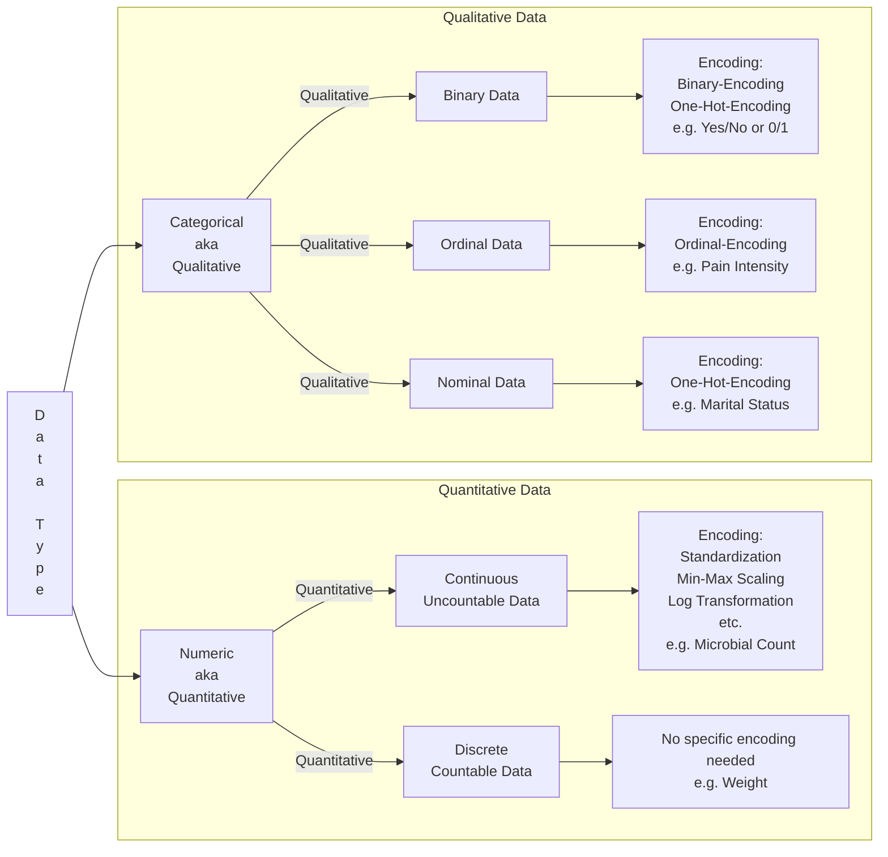

### [Go to Home Page](https://github.com/celik-muhammed)

  
| [][Linkedin] | [][kaggle] | [][tableau] | [<picture><source media="(prefers-color-scheme: dark)" srcset="https://theme.zdassets.com/theme_assets/224203/4a55138e21ad44a9c72c8295181c79fe938a2ae6.svg" alt="kaggle" height="26"></picture>][medium] | [][github_pages] |
|:-:|:-:|:-:|:-:|:-:|
<!-- CHANGE-05 .../myname/ myname yerine profil user name yaz -->
[Linkedin]: https://www.linkedin.com/in/çelik-muhammed/ "LinkedIn"
[kaggle]: https://www.kaggle.com/clkmuhammed "Kaggle Page"
[tableau]: https://public.tableau.com/app/profile/celikmuhammed "Tableau Page"
[medium]: https://celik-muhammed.medium.com/ "Medium Page"
[github_pages]: https://celik-muhammed.github.io/ "GitHub Pages"

<h3 align='right'>
  
[14CS Machine Learning Case Studies with Python](https://github.com/celik-muhammed/14CS-Machine-Learning-Case-Studies-with-Python/blob/master/README.md)
</h3>

  
<table align="center">
    <caption>
Machine Learning Projects with Python
</caption>
<thead align='left'><tr><th colspan=2>1. Supervised Learning</th></tr></thead>
<thead><tr><th>1.1 Regression</th><th>1.2 Classification</th></tr></thead>
<tbody>
  <tr>
    <td rowspan="2"><a href="https://github.com/celik-muhammed/ML-Autoscout-Car-Price-Prediction-Project/blob/master/README.md">01. ML Autoscout Car Price Prediction</a></td>
    <td><a href="https://github.com/celik-muhammed/ML-Soldiers-Race-Classification-Project/blob/master/README.md">01. ML Soldiers Race Classification</a></td>
  </tr>
  <tr>
<!--     <td><a href="https://www.kaggle.com/code/clkmuhammed/credit-score-classification-logreg-rf-xgb-deploy/notebook">02. Kaggle: Credit Score Classification</a></td> -->
  </tr>
</tbody>
<thead align='left'><tr><th colspan=2>2. Unsupervised Learning</th></tr></thead>
<thead><tr><th>2.1 Clustering</th><th>2.2 Dimension Reduction (PCA)</th></tr></thead>
<tbody>
  <tr>
    <td><a href="https://github.com/celik-muhammed/ML-Customers-Segmentation-Cluestering-Analysis-Project/blob/master/README.md">01. ML-Customers-Segmentation-Cluestering-Analysis</a></td>
    <td></td>
  </tr>
  <tr>
    <td><a href="https://github.com/celik-muhammed/CapstoneP-Customer-Segmentation-Cluestering-Analysis#readme">02. Capstone Project Customer Segmentation Cluestering Analysis</a></td>
  </tr>
</tbody>
  
<tfoot>
  <tr><td>draft</td></tr>
</tfoot>
</table>

  
  

 

  
  

# **Optimization Algorithms in Machine Learning**

Once upon a time in the world of computing, there was a quest to teach machines to learn and make smart decisions. This journey was not just about giving machines knowledge but also the wisdom to refine that knowledge. Imagine a group of dedicated explorers known as "**Data Scientists.**" They embarked on this quest armed with a powerful tool: **Optimization Algorithms.** These algorithms were like magic spells that fine-tuned the abilities of machines to predict, classify, and uncover hidden patterns.

In their bag of tricks, they had the mighty "**Gradient Descent,**" a wand that optimized models to minimize errors. They also had "**K-Means Clustering,**" a compass that guided them through data's uncharted territories. But this adventure wasn't just about technology; it was also a journey of understanding, like discovering the secret language of "**t-SNE**" to visualize data's stories. They learned to solve complex riddles using "**Q-Learning**" and "**Actor-Critic**" methods, teaching machines how to make the best decisions.

# **Supervised Machine Learning**

**Supervised machine learning** involves training models on labeled data, where the algorithm learns to make predictions or decisions based on input-output pairs. In this context, **optimization algorithms** are crucial for fine-tuning model parameters to minimize the error or cost function. Here are some **optimization algorithms** and **Models** commonly used in supervised machine learning:

01. **Gradient Descent**
   - **Batch Gradient Descent:** A method that employs the entire training dataset for updating model parameters. It aims to find the global minimum but can be slow on large datasets. Real-world example: Training a linear regression model to predict house prices based on features like square footage, number of bedrooms, and location.
   - **Stochastic Gradient Descent (SGD):** Parameters are updated using a single random training example, suitable for large datasets. It converges faster but exhibits more oscillations in the cost function.
   - **Mini-Batch Gradient Descent:** A balanced approach using random data subsets for optimization. It combines the strengths of both batch and stochastic gradient descent.

02. **Closed-Form Solutions**

Some linear models, like linear regression, have closed-form solutions for optimal parameter estimation. They're computationally efficient but may not be applicable to complex models. Real-world example: Using linear regression to predict a company's quarterly earnings based on historical financial data.

03. **Regularized Models**
   - **Ridge and Lasso Regression:** These employ optimization techniques tailored to the L2 and L1 regularization terms, respectively. They're effective in combating overfitting in linear models. Real-world example: Applying Lasso regression for feature selection in a machine learning model for medical diagnosis.
   - **Elastic Net:** Combining L1 and L2 regularization, it provides a flexible approach to regularization.
     
04. **Logistic Regression**
   
This is widely used for classification tasks and employs optimization methods such as gradient descent or quasi-Newton methods. Logistic regression is fundamental for binary and multiclass classification. Real-world example: Using logistic regression to classify emails as spam or not spam based on text features.

05. **Support Vector Machines (SVM)**
   
To find the maximum-margin hyperplane, SVMs require specialized optimization algorithms like Sequential Minimal Optimization (SMO). They excel in classification and regression tasks. Real-world example: Using an SVM for image classification, distinguishing between cats and dogs based on image features.

06. **Neural Networks**
   
Deep learning models depend heavily on optimization methods such as Stochastic Gradient Descent (SGD), Adam, RMSprop, and more. Deep learning has revolutionized various areas of machine learning, including image recognition, natural language processing, and reinforcement learning. Real-world example: Training a deep neural network for natural language processing to perform sentiment analysis on customer reviews.

07. **Decision Trees and Random Forests**
    
Optimization focuses on finding the best split points and trees that minimize impurity. Random forests combine multiple decision trees and use ensemble techniques that combine the predictions of multiple individual models (often called "base models" or "weak learners") to make a more accurate and robust prediction to improve accuracy and reduce overfitting. Real-world example: Using a random forest model to predict customer churn in a subscription-based service.

08. **Gradient Boosting**
   
Algorithms like XGBoost, LightGBM, and CatBoost use gradient-based optimization to enhance ensemble models (final combined models). They excel in both classification and regression problems. Real-world example: Using XGBoost to predict stock price movements based on historical market data.

09. **Linear Discriminant Analysis (LDA)**
    
LDA's primary goal in the context of classification is to find a linear combination of features that best separates two or more classes. It does this by maximizing the differences between class means while minimizing the variations within each class. LDA seeks to optimize the linear coefficients that define this combination of features to achieve the objectives mentioned above. 

The optimization problem in LDA typically involves finding the coefficients that maximize a certain objective function, such as the ratio of between-class variance to within-class variance (Fisher's discriminant criterion). This is usually done using techniques like eigenvalue decomposition or singular value decomposition, which help determine the optimal linear coefficients. These coefficients are used to project the data into a lower-dimensional space, making LDA a powerful method for feature extraction and classification.

10. **Generalized Linear Models (GLM)**
    
GLMs are a class of supervised learning models, commonly used for regression and classification tasks. GLMs are an extension of traditional linear regression, but they allow for a broader range of target variable types, not limited to continuous values. They can handle various types of response variables, including continuous, binary, count, and more. 

The optimization method used for fitting GLMs typically involves maximizing the likelihood function. The specific optimization algorithm employed may vary depending on the software or library used for modeling. Common optimization techniques for GLMs include iterative algorithms like Newton-Raphson, Fisher scoring, and gradient descent methods, depending on the specific problem and software implementation.

# **Unsupervised Machine Learning**

**Unsupervised machine learning** deals with data lacking explicit labels or targets, focusing on discovering hidden patterns, clusters, or representations within the data. **Optimization** is often used for tasks such as clustering, dimensionality reduction, and density estimation in unsupervised learning. Common **optimization algorithms** in this context include:

01. **K-Means Clustering**
  
This algorithm optimizes cluster centroids to minimize the within-cluster sum of squares. It is widely used for data clustering and segmentation. Real-world example: Segmenting customers into groups for targeted marketing based on their purchase histories.

02. **Hierarchical Clustering**
   
Hierarchical algorithms optimize cluster linkage at various levels, providing a tree-like structure of cluster relationships. They are valuable for understanding data hierarchy. Real-world example: Analyzing genetic data to identify evolutionary relationships among species.

03. **Principal Component Analysis (PCA)**
  
PCA optimizes orthogonal axes to capture maximum data variance. It is a foundational technique for dimensionality reduction and data compression. Real-world example: Reducing the dimensionality of images for facial recognition systems.

04. **t-Distributed Stochastic Neighbor Embedding (t-SNE)**

This method optimizes the similarity between high-dimensional and low-dimensional data representations, making it valuable for visualization and preserving local structure. Real-world example: Visualizing high-dimensional data, such as word embeddings in natural language processing.

05. **Autoencoders**

These neural network-based models facilitate dimensionality reduction by optimizing encoder and decoder networks. They are versatile for feature learning and data generation tasks. Real-world example: Anomaly detection in network security using autoencoders to detect unusual network activity.

06. **Gaussian Mixture Models (GMM)**

GMMs estimate parameters like mean and covariance to model data distributions. They are used in data modeling and clustering tasks. Real-world example: Modeling the distribution of colors in an image to separate foreground and background objects.

07. **Latent Dirichlet Allocation (LDA)**

LDA optimizes topic-word and document-topic distributions for topic modeling. It is essential for uncovering latent themes in text data. Real-world example: Analyzing a collection of news articles to identify the prevalent topics in a given time period.

08. **Variational Autoencoders (VAE)**

These models combine optimization with probabilistic modeling for unsupervised learning and data generation. They offer a probabilistic approach to generative modeling. Real-world example: Generating realistic human faces for use in video games or simulations.

09. **Isomap and Locally Linear Embedding (LLE)**

These techniques optimize the representation of data in a lower-dimensional space while preserving local properties. They are valuable for nonlinear dimensionality reduction. Real-world example: Visualizing the structure of a complex biological network for better understanding and analysis.

# **Reinforcement Machine Learning**

**Reinforcement learning** focuses on training agents to make a sequence of decisions or actions to maximize a cumulative reward signal. **Optimization algorithms** are vital for finding the optimal policy or value function. Common **optimization algorithms** in reinforcement learning include:

01. **Q-Learning**

An off-policy method that optimizes the Q-value function to estimate the expected cumulative reward for each action-state pair. It is a foundational algorithm for reinforcement learning. Real-world example: Training an autonomous drone to navigate a complex environment and avoid obstacles.

02. **Policy Gradient Methods**

These methods optimize the policy directly by adjusting its parameters to maximize expected rewards. This includes algorithms like REINFORCE, which are essential for policy optimization. Real-world example: Teaching a computer program to play chess by maximizing its chances of winning.

03. **Deep Q-Networks (DQN)**

DQNs combine Q-learning with deep neural networks and use optimization methods like experience replay and target networks. They have been influential in applying deep learning to reinforcement learning. Real-world example: Developing an AI agent to play and excel at video games like Atari's Breakout.

04. **Proximal Policy Optimization (PPO)**

PPO is a policy gradient method that optimizes the policy while ensuring stable and efficient learning. It is known for its robustness and performance in various tasks. Real-world example: Training a robot to perform complex tasks in an unstructured environment, such as a warehouse.

05. **Actor-Critic Methods**

These methods utilize both policy (actor) and value function (critic) networks and optimize them using various techniques, including advantage-based methods. Actor-critic algorithms strike a balance between exploration and exploitation. Real-world example: Autonomous vehicles using actor-critic methods to navigate traffic and make safe driving decisions.

06. **Monte Carlo Tree Search (MCTS)**

An algorithm used in decision-making for games and planning tasks, MCTS optimizes the tree of possible actions. It is prominent in game AI and strategic decision-making. Real-world example: Designing a computer program to play the board game Go at a superhuman level.

**Optimization algorithms** play a critical role in machine learning, shaping the way models learn from data, discover patterns, and make decisions. They are foundational to a wide range of applications, from predicting financial market trends and autonomous vehicle navigation to healthcare diagnostics and natural language understanding. Understanding and applying these **algorithms** is not only valuable for data scientists and machine learning practitioners but also for anyone seeking to leverage the power of AI in today's data-driven world.

# Links:
- https://web.stanford.edu/~jurafsky/slp3/5.pdf
- https://www.kdnuggets.com/2021/05/deal-with-categorical-data-machine-learning.html

  
---

# Course Training Structure

1. **Lecture**: Begin with lectures to **introduce** the foundational **concepts** and **theories**.
2. **Tutorial**: Follow with tutorials that provide more **detailed explanations** and **examples** to reinforce the **lecture material**.
3. **Workshop**: Continue with workshops that offer **interactive**, **practical** sessions to apply what has been learned.
4. **Labs**: Move on to lab sessions that involve **hands-on experiments** or **exercises** to deepen understanding through **practice**.
5. **Projects**: Progress to projects that **require** students to **apply** their **knowledge** and **skills** to more complex and comprehensive **tasks**.
6. **Notes**: Provide notes throughout the **course for reference and review**.
