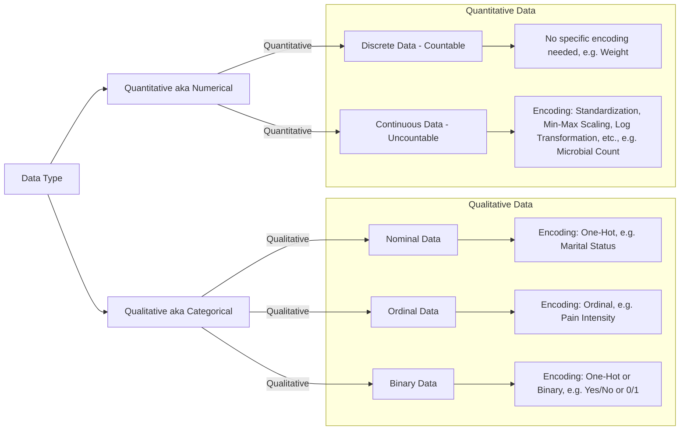

### [Go to Home Page](https://github.com/celik-muhammed)

  
| [][Linkedin] | [][kaggle] | [][tableau] | [<picture><source media="(prefers-color-scheme: dark)" srcset="https://theme.zdassets.com/theme_assets/224203/4a55138e21ad44a9c72c8295181c79fe938a2ae6.svg" alt="kaggle" height="26"></picture>][medium] | [][github_pages] |
|:-:|:-:|:-:|:-:|:-:|
<!-- CHANGE-05 .../myname/ myname yerine profil user name yaz -->
[Linkedin]: https://www.linkedin.com/in/çelik-muhammed/ "LinkedIn"
[kaggle]: https://www.kaggle.com/clkmuhammed "Kaggle Page"
[tableau]: https://public.tableau.com/app/profile/celikmuhammed "Tableau Page"
[medium]: https://celik-muhammed.medium.com/ "Medium Page"
[github_pages]: https://celik-muhammed.github.io/ "GitHub Pages"

<h3 align='right'>
  
[14CS Machine Learning Case Studies with Python](https://github.com/celik-muhammed/14CS-Machine-Learning-Case-Studies-with-Python/blob/master/README.md)
</h3>

  
<table align="center">
    <caption>
Machine Learning Projects with Python
</caption>
<thead align='left'><tr><th colspan=2>1. Supervised Learning</th></tr></thead>
<thead><tr><th>1.1 Regression</th><th>1.2 Classification</th></tr></thead>
<tbody>
  <tr>
    <td rowspan="2"><a href="https://github.com/celik-muhammed/ML-Autoscout-Car-Price-Prediction-Project/blob/master/README.md">01. ML Autoscout Car Price Prediction</a></td>
    <td><a href="https://github.com/celik-muhammed/ML-Soldiers-Race-Classification-Project/blob/master/README.md">01. ML Soldiers Race Classification</a></td>
  </tr>
  <tr>
<!--     <td><a href="https://www.kaggle.com/code/clkmuhammed/credit-score-classification-logreg-rf-xgb-deploy/notebook">02. Kaggle: Credit Score Classification</a></td> -->
  </tr>
</tbody>
<thead align='left'><tr><th colspan=2>2. Unsupervised Learning</th></tr></thead>
<thead><tr><th>2.1 Clustering</th><th>2.2 Dimension Reduction (PCA)</th></tr></thead>
<tbody>
  <tr>
    <td><a href="https://github.com/celik-muhammed/ML-Customers-Segmentation-Cluestering-Analysis-Project/blob/master/README.md">01. ML-Customers-Segmentation-Cluestering-Analysis</a></td>
    <td></td>
  </tr>
  <tr>
    <td><a href="https://github.com/celik-muhammed/CapstoneP-Customer-Segmentation-Cluestering-Analysis#readme">02. Capstone Project Customer Segmentation Cluestering Analysis</a></td>
  </tr>
</tbody>
  
<tfoot>
  <tr><td>draft</td></tr>
</tfoot>
</table>

  

# Optimization Algorithms

## 1. Supervised Machine Learning

Supervised machine learning involves training models on labeled data, where the algorithm learns to make predictions or decisions based on input-output pairs. In this context, optimization algorithms are crucial for fine-tuning model parameters to minimize the error or cost function. Here are some optimization algorithms commonly used in supervised machine learning:

- **Gradient Descent**:
   - *Batch Gradient Descent*: Utilizes the entire training dataset to update model parameters. It can converge to the global minimum but can be slow on large datasets. Real-world example: Training a linear regression model to predict house prices based on features like square footage, number of bedrooms, and location.

- **Closed-Form Solutions**:
   - Some linear models, like linear regression, have closed-form solutions for optimal parameter estimation. Real-world example: Using linear regression to predict a company's quarterly earnings based on historical financial data.

- **Regularized Models**:
   - Ridge and Lasso Regression: Use optimization techniques tailored to the L2 and L1 regularization terms, respectively. They are effective for preventing overfitting in linear models. Real-world example: Applying Lasso regression for feature selection in a machine learning model for medical diagnosis.

- **Logistic Regression**: Used for classification tasks, employs optimization methods like gradient descent or quasi-Newton methods. Real-world example: Using logistic regression to classify emails as spam or not spam based on text features.

- **Support Vector Machines (SVM)**: Requires specialized optimization algorithms, such as Sequential Minimal Optimization (SMO), to find the maximum-margin hyperplane. Real-world example: Using an SVM for image classification, distinguishing between cats and dogs based on image features.

- **Neural Networks**: Training deep learning models relies heavily on optimization methods like Stochastic Gradient Descent (SGD), Adam, RMSprop, and more. Real-world example: Training a deep neural network for natural language processing to perform sentiment analysis on customer reviews.

- **Decision Trees and Random Forests**: Optimization aims at finding the best split points and trees that minimize impurity. Real-world example: Using a random forest model to predict customer churn in a subscription-based service.

- **Gradient Boosting**: Algorithms like XGBoost, LightGBM, and CatBoost use gradient-based optimization to boost ensemble models. They excel in both classification and regression problems. Real-world example: Using XGBoost to predict stock price movements based on historical market data.

## 2. Unsupervised Machine Learning

Unsupervised machine learning deals with data lacking explicit labels or targets, focusing on discovering hidden patterns, clusters, or representations within the data. Optimization is often used for tasks such as clustering, dimensionality reduction, and density estimation in unsupervised learning. Common optimization algorithms in this context include:

- **K-Means Clustering**: Optimizes cluster centroids to minimize the within-cluster sum of squares. It is a widely used algorithm for data clustering and segmentation. Real-world example: Segmenting customers into groups for targeted marketing based on their purchase histories.

- **Hierarchical Clustering**: Hierarchical algorithms optimize cluster linkage at different levels, providing a tree-like structure of cluster relationships. They are valuable for understanding data hierarchy. Real-world example: Analyzing genetic data to identify evolutionary relationships among species.

- **Principal Component Analysis (PCA)**: Optimizes orthogonal axes to maximize data variance capture. PCA is a foundational technique for dimensionality reduction and data compression. Real-world example: Reducing the dimensionality of images for facial recognition systems.

- **t-Distributed Stochastic Neighbor Embedding (t-SNE)**: Optimizes the similarity between high-dimensional and low-dimensional data representations. It is valuable for visualization and preserving local structure. Real-world example: Visualizing high-dimensional data, such as word embeddings in natural language processing.

- **Autoencoders**: Neural network-based models for dimensionality reduction that involve optimizing encoder and decoder networks. They are versatile for feature learning and data generation tasks. Real-world example: Anomaly detection in network security using autoencoders to detect unusual network activity.

- **Gaussian Mixture Models (GMM)**: Estimate parameters like mean and covariance to model data distributions. GMMs are used in data modeling and clustering tasks. Real-world example: Modeling the distribution of colors in an image to separate foreground and background objects.

- **Latent Dirichlet Allocation (LDA)**: Optimizes topic-word and document-topic distributions for topic modeling. LDA is essential for uncovering latent themes in text data. Real-world example: Analyzing a collection of news articles to identify the prevalent topics in a given time period.

- **Variational Autoencoders (VAE)**: Combine optimization with probabilistic modeling for unsupervised learning and data generation. They offer a probabilistic approach to generative modeling. Real-world example: Generating realistic human faces for use in video games or simulations.

- **Isomap and Locally Linear Embedding (LLE)**: Optimize the representation of data in a lower-dimensional space while preserving local properties. These methods are valuable for nonlinear dimensionality reduction. Real-world example: Visualizing the structure of a complex biological network for better understanding and analysis.

## 3. Reinforcement Machine Learning

Reinforcement learning focuses on training agents to make a sequence of decisions or actions to maximize a cumulative reward signal. Optimization algorithms are vital for finding the optimal policy or value function. Common optimization algorithms in reinforcement learning include:

- **Q-Learning**: An off-policy method that optimizes the Q-value function to estimate the expected cumulative reward for each action-state pair. Q-learning is a foundational algorithm for reinforcement learning. Real-world example: Training an autonomous drone to navigate a complex environment and avoid obstacles.

- **Policy Gradient Methods**: Optimize the policy directly by adjusting its parameters to maximize expected rewards. This includes algorithms like REINFORCE, which are essential for policy optimization. Real-world example: Teaching a computer program to play chess by maximizing its chances of winning.

- **Deep Q-Networks (DQN)**: Combines Q-learning with deep neural networks, using optimization methods like experience replay and target networks. DQN has been influential in applying deep learning to reinforcement learning. Real-world example: Developing an AI agent to play and excel at video games like Atari's Breakout.

- **Proximal Policy Optimization (PPO)**: A policy gradient method that optimizes the policy while ensuring stable and efficient learning. PPO is known for its robustness and performance in various tasks. Real-world example: Training a robot to perform complex tasks in an unstructured environment, such as a warehouse.

- **Actor-Critic Methods**: Utilize both policy (actor) and value function (critic) networks and optimize them using various techniques, including advantage-based methods. Actor-critic algorithms strike a balance between exploration and exploitation. Real-world example: Autonomous vehicles using actor-critic methods to navigate traffic and make safe driving decisions.

- **Monte Carlo Tree Search (MCTS)**: An algorithm used in decision-making for games and planning tasks, optimizing the tree of possible actions. MCTS is prominent in game AI and strategic decision-making. Real-world example: Designing a computer program to play the board game Go at a superhuman level.

Optimization plays a crucial role in various real-world applications, ranging from predicting house prices and customer behavior to autonomous driving and game playing. It has transformed many industries and continues to advance the field of machine learning.
